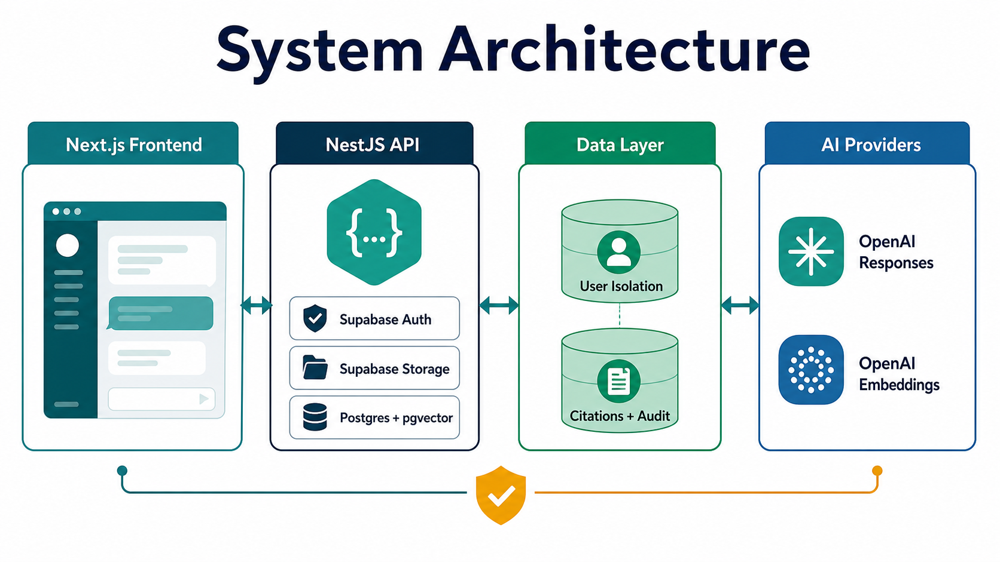
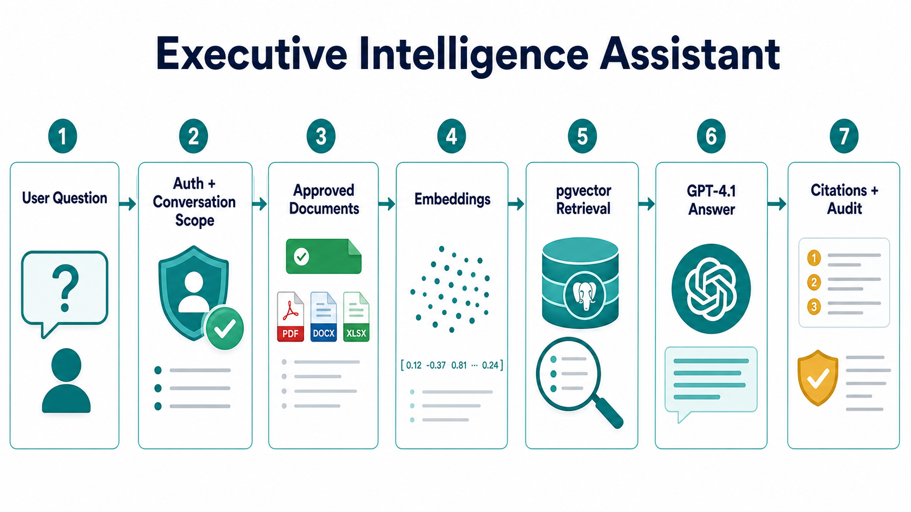
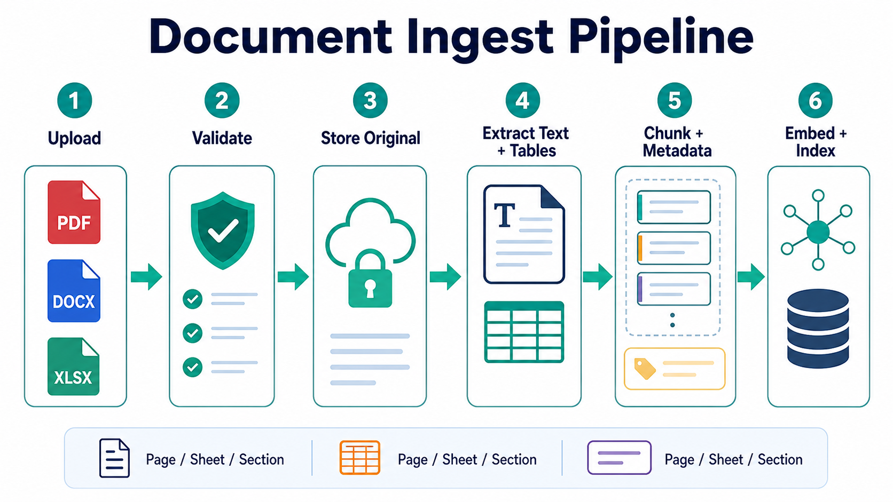
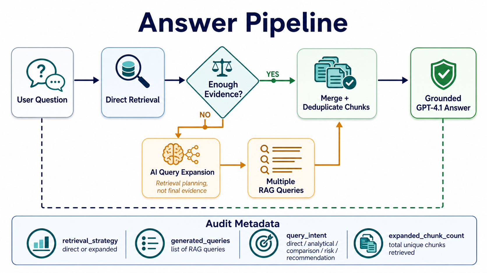
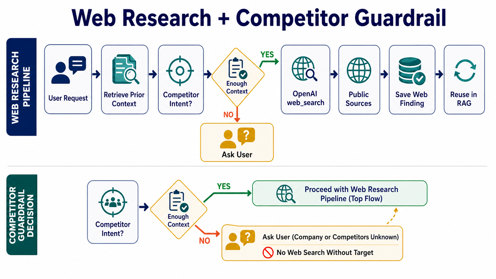

# Executive Intelligence Assistant

<p>
  
  
  
  
  
  
  
  
</p>

RAG for executive work. Upload docs. Ask. Get cited answers. Add web research when live public evidence is needed.

No RBAC. Auth only. Each user gets isolated conversations, documents, history, and learned style preferences.

## Visual Walkthrough

These infographics give a quick recruiter-friendly view of the system before the implementation details.

### System Architecture



### RAG Core Pipeline



### Document Ingest Pipeline



### Answer Pipeline With Query Expansion



### Web Research Guardrail



## Stack

| Layer | Tool |
| --- | --- |
| Frontend | Next.js 14, React, Tailwind |
| Backend | NestJS, TypeScript |
| Auth | Supabase Auth, magic link, seeded email/password for tests |
| Storage | Supabase Storage |
| Database | Supabase Postgres, pgvector |
| Embeddings | OpenAI `text-embedding-3-small`, 768 dims |
| Generation | OpenAI Responses API, `gpt-4.1` |
| Web | OpenAI hosted `web_search` |
| Deploy | Vercel frontend, Render backend |

## RAG Core

```text
user
  -> auth
  -> conversation scope
  -> approved docs
  -> embeddings
  -> pgvector retrieval
  -> GPT-4.1 answer
  -> citations + confidence + audit
```

Rules:

- User owns conversations.
- Conversation owns docs and web findings.
- Retrieval is scoped by conversation.
- Uploaded docs are the default truth.
- Web findings join RAG only in web research mode.
- Preferences change style only. Never facts.
- No cited evidence, no strong claim.

## Ingest Pipeline

```text
upload
  -> validate file type and size
  -> save original to Supabase Storage
  -> create document row
  -> extract text/tables
  -> chunk with page/sheet/section metadata
  -> embed with OpenAI
  -> save chunks + vectors
  -> mark indexed
```

Supported files: `pdf`, `docx`, `xlsx`.

Chunks keep source metadata. Citations can point back to document, page, sheet, section, URL, and chunk id.

## Answer Pipeline

```text
question
  -> embed query
  -> match_document_chunks()
  -> filter by approval + source type + similarity
  -> analytical fallback retrieval when needed
  -> build prompt with retrieved context
  -> GPT-4.1 Responses call
  -> save user + assistant messages
  -> save assistant_run audit record
```

Default answer modes use uploaded documents only.

If retrieval is weak, the assistant refuses instead of inventing.

Analytical questions get one extra pass:

```text
risk / next-step / recommendation question
  -> exact retrieval first
  -> if too narrow, retrieve broader project scope
  -> answer from facts + labelled inference
```

Allowed:

- infer risks from documented modules, actors, workflows, dependencies, and goals
- recommend next steps derived from uploaded evidence
- label output as `Document states` vs `Inferred from the documents`

Not allowed:

- present inference as stated fact
- use outside knowledge in document mode
- answer with no supporting chunks

## Web Research Pipeline

```text
web research request
  -> retrieve prior conversation context
  -> GPT-4.1 Responses API
  -> require OpenAI web_search
  -> collect URL citations
  -> return answer + sources
  -> save synthetic web_research document
  -> embed and store it in the same conversation RAG
```

Why save web findings: next question can reuse the public evidence already found, still scoped to the same user conversation.

OpenAI docs used:

- Responses API: https://developers.openai.com/api/reference/resources/responses/methods/create
- Web search tool: https://developers.openai.com/api/docs/guides/tools-web-search
- Streaming events: https://platform.openai.com/docs/api-reference/responses-streaming

## Preference Pipeline

```text
answer generated
  -> inspect durable style signal
  -> update user preference profile if useful
  -> retrieve profile next time
  -> inject as style context only
```

Example: one seeded user prefers Arabic. The agent answers in Arabic because that preference is retrieved and passed as user style context, not hardcoded in a system prompt.

## Deck Pipeline

```text
deck request
  -> retrieve cited chunks
  -> generate strict JSON deck spec
  -> persist deck
  -> render editable PPTX
```

Decks stay grounded. Unsupported charts become tables or callouts.

## Gemini To OpenAI

First version used Gemini:

- Gemini embeddings.
- Gemini Flash generation.
- Google Search grounding.

Problem: demo usage hit provider quota/code limits. Generation and embeddings became blocked during testing.

Current version uses OpenAI:

- `gpt-4.1` for generation.
- Responses API for text and streaming.
- Hosted `web_search` for cited public research.
- `text-embedding-3-small` for vectors.

Result: one provider. Simpler env. Same RAG contract. Better deploy story.

## Backend Env

```bash
SUPABASE_URL=
SUPABASE_SERVICE_ROLE_KEY=
SUPABASE_STORAGE_BUCKET=documents
DATABASE_URL=
OPENAI_API_KEY=
GENERATION_BASE_URL=https://api.openai.com/v1
GENERATION_MODEL=gpt-4.1
EMBEDDING_BASE_URL=https://api.openai.com/v1
EMBEDDING_MODEL=text-embedding-3-small
EMBEDDING_DIMENSIONS=768
ENABLE_WEB_RESEARCH=true
CORS_ORIGINS=http://localhost:3000
PORT=8080
```

## Frontend Env

```bash
NEXT_PUBLIC_API_URL=http://localhost:8080
NEXT_PUBLIC_SUPABASE_URL=
NEXT_PUBLIC_SUPABASE_ANON_KEY=
NEXT_PUBLIC_ENABLE_PASSWORD_AUTH=true
NEXT_PUBLIC_ENABLE_WEB_RESEARCH=true
```

Production:

- `NEXT_PUBLIC_API_URL=https://executive-intelligence-assistant.onrender.com`
- `CORS_ORIGINS=https://your-vercel-domain.vercel.app`
- Supabase redirect URL must include the Vercel domain.

## Run Local

Backend:

```bash
cd backend
npm install
npm run start:dev
```

Frontend:

```bash
cd frontend
npm install
npm run dev
```

Seed demo data:

```bash
cd backend
npm run reset:seed
```

This deletes seeded app data, recreates fictional users/docs/history, and creates one Arabic-first preference profile.

## Deploy

Render backend:

```bash
Root Directory: backend
Build Command: npm install && npm run build
Start Command: npm run start:prod
Health Check: /api/health
```

Vercel frontend:

```bash
Root Directory: frontend
Build Command: npm run build
Output: .next
```

## Checks

```bash
cd backend && npm run typecheck && npm run build
cd frontend && npm run typecheck && npm run build
```

## Security Shape

- Browser never gets OpenAI key.
- Browser never gets Supabase service role key.
- Backend validates Supabase JWT.
- CORS is explicit allowlist.
- Web results are cited and saved as `web_research`, not mixed with uploaded docs silently.
- Seed data uses fictional companies only.
